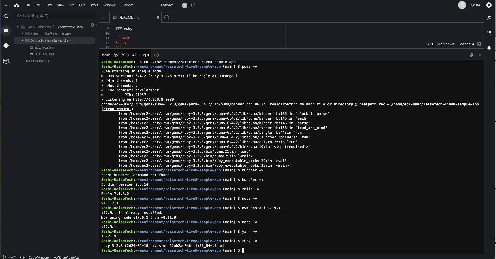
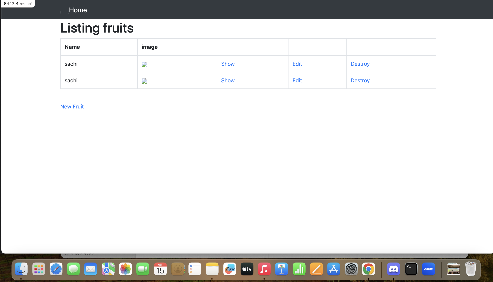
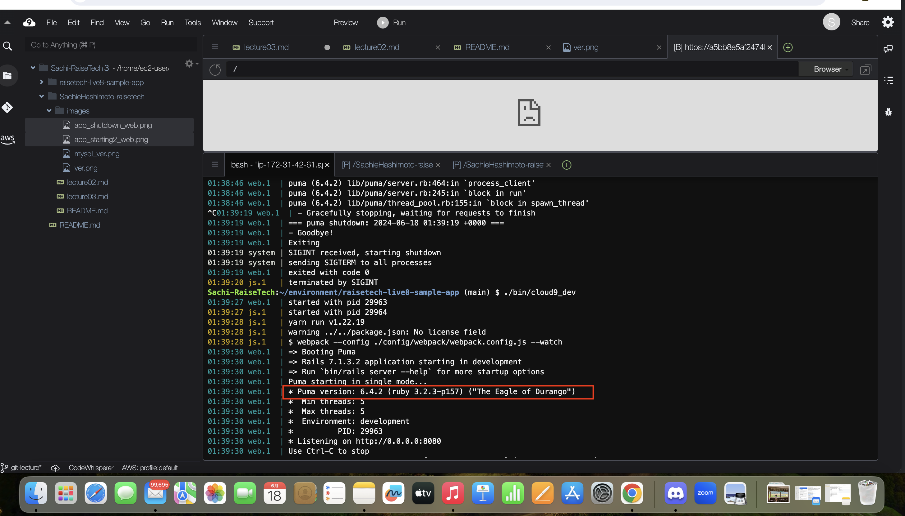
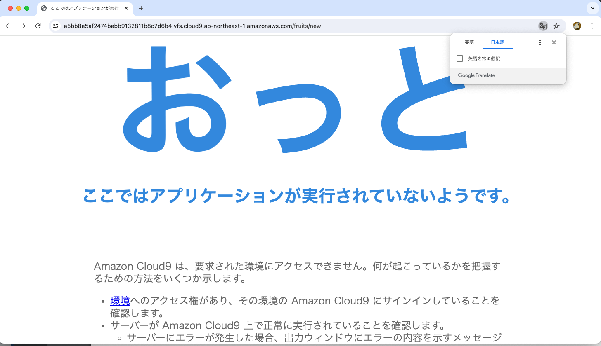
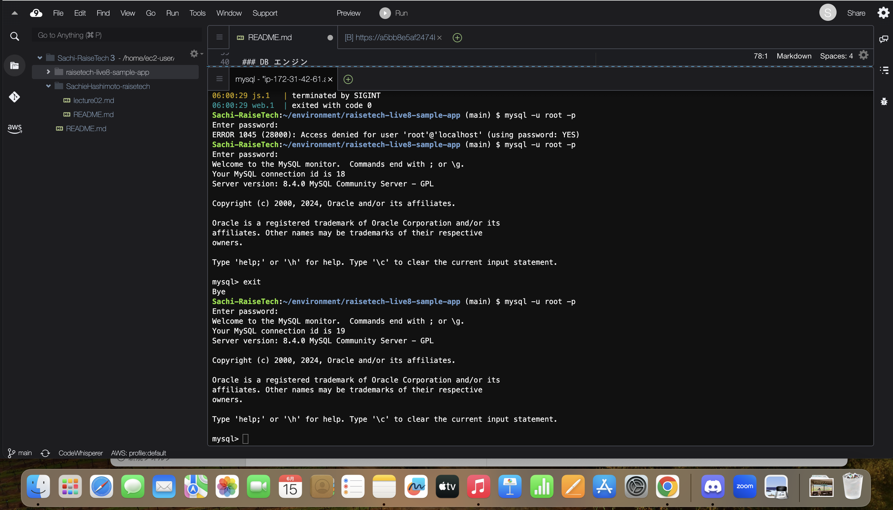
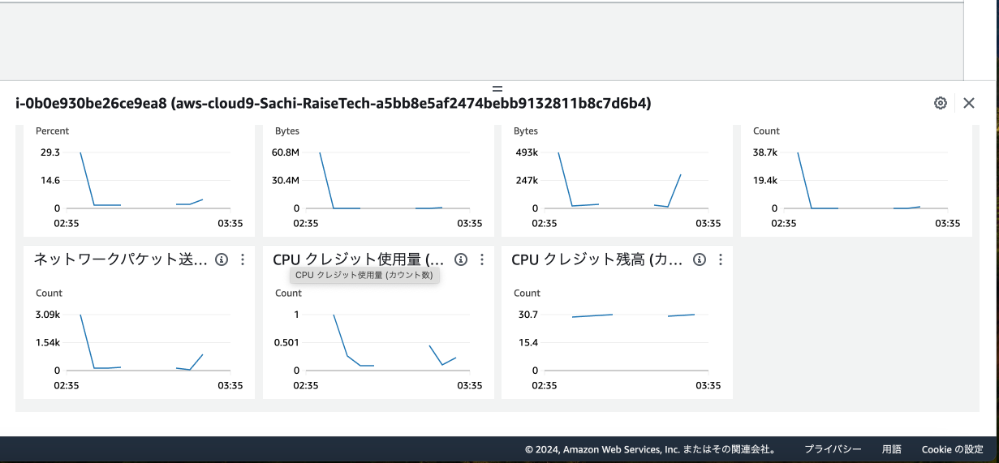
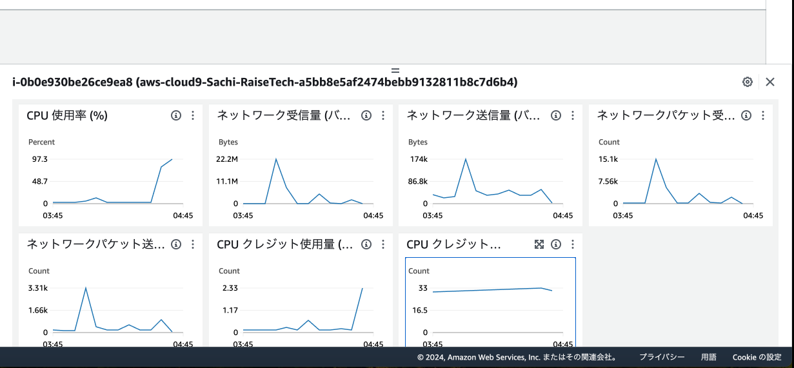
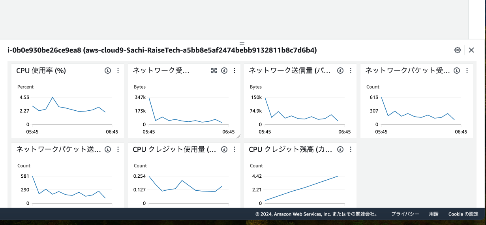
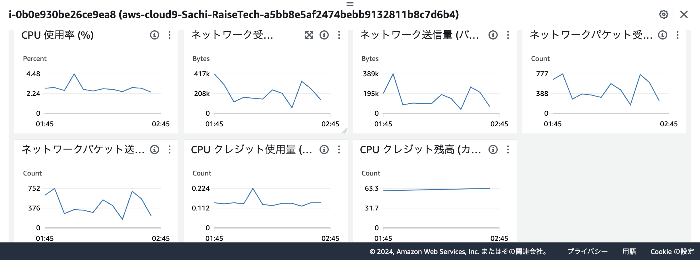

# 第３回課題についてのレポート 
＜講義の概要＞  
- webアプリケーションについて  
 webアプリケーションとは「Webブラウザ上で利用できるアプリケーション」の事  
 クライアントがHTTPリクエストをし、サーバーがHTTPレスポンスすることで成立する。  
 Rubyなどの言語、画面を表示させるHTML/CSS、通信やブラウザの挙動などの知識を集結させて開発されている。  
 インフラエンジニアも用語やそれぞれの関係性等ある程度の知識が必要。  
 リクエストとレスポンンスのやりとりのことを『通信』という。  
- 通信について
  HTTPリクエスト…・リクエストライン・ヘッダ・ボディの3部構成でサーバーに送る（ボディはないこともある）
　HTTPレスポンス…・ステータスライン・ヘッダ・ボディの3部構成でクライアントに返す。  
　ステートレスなやり取り…サーバーがやり取りを記憶しない。レスポンスが早くなる。
　ステートフルなやり取り…サーバーがやりとりを記憶する。（例。ECサイトの買い物かご）
　

- システム（アプリケーション）開発の流れ
　V字モデル、W字モデルの工程をそれぞれ適切な流れ（ウォーターフォール/アジャイル/スクラム）の中で開発していく。
　計画どおりに進む事ばかりではないので、
　限られた時間の中でより良いものを作るため、問題は起こると想定して工程を意識しながら働くこともエンジニアとして必要な能力である

- サンプルアプリケーションを使い、ブラウザで起動を確認するまでのデモンストレーション。  
  cloud９にサンプルアプリケーションをクローンし、動作環境を揃えて起動する。

＜課題画像＞  
動作環境の一致画像  
   
サンプルアプリケーションcloud９起動画像  
   
 ブラウザでの起動確認　  
   
 APサーバー（puma）バージョン確認 起動&停止確認  
   
 APサーバーを停止させると、WEBでは確認できなくなった。  
   
 DBサーバー（MySQL）バージョン確認( MySQL8.4.0)  
  
 
 Railsの構成管理は**Bundler**です。
 

＜課題の感想＞  
動作環境を揃える時に、講義と同じように進めたつもりでも、フリーズしてしまうことが多々あった。  
「CPUに負荷がかかっている」「メモリ不足」等の警告表示が出ていたため、
最終的に作成したcloud９ではハンズオン指示の１６Gよりも大きい２０Gでストレージを作成した。  
併せてEC2でモニタリング画面と『df -h』コマンドでEBS全体の使用率を観察しながら進めていった。  
**結果、アプリ起動確認後もストレージには余裕があった。**  
調べると**メモリ不足（ランダムアクセスメモリが不足）とストレージ不足を混同していたことがわかった。**  
フリーズの原因はストレージ容量とは関係なく、インスタンスタイプを無料枠のt2.micro (1 GiB RAM + 1 vCPU)で作成した為だった。    
フリーズで時間を取られたので、次はクレードをあげて cloud９作成をする選択肢も増やしたい。

〜〜以下検証の過程を載せます〜〜

1. cloud９作成&ストレージ容量変直後の『df -h』(抜粋)  
　**/dev/xvda1 20G 6.8G 14G 34% /**  
 EC２モニタリング画像  

1. rubyインストール中にフリーズした時のモニタリング画像  
  
1. インスタンス再起動しcloud９が再起動できた時のモタリング画像  
   

1. アプリ起動確認後の『df -h』(抜粋)  
  **/dev/xvda1 20G 8.9G 12G 45% /**  
EC２モニタリング画像   
  