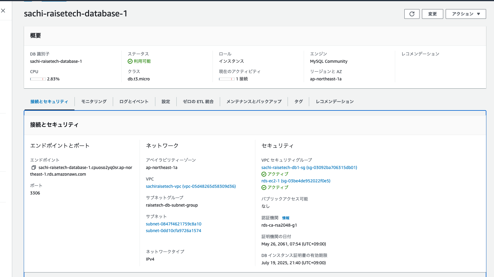

# 第4回課題提出  

  
## ・VPC作成  
  
VPC構成内容  
 
  
## ・EC2作成  
 
EC2構成内容  
  
  
  
 
  

## ・RDS作成
  
RDS構成内容  
  

  
 

### 追記 セキュリティグループの詳細
「rds-ec2-1」  

  
  

「sachi-raisetech-db 1-sg 」インバウンド
    
 
  

「sachi-raisetech-db  1-sg 」アウトバウンド
   
 

### 追記　サブネットグループの詳細
  
  
  
  
## ・EC2からRDSに接続
  
 

## ・課題を終えての感想  
とても時間をかけてしまった。  
初めよくわからないまま一通り作ったが、EC2にアクセスできず、VPCのサブネット構成もRDSの作り方を間違えていたので変わってしまっていたので一旦すべて削除した。  
AWSやインターネット技術の入門書を色々と読んでからは、ある程度判断しながら再作成できたように思う。  
今回の課題からMACのターミナルを使用しました。  
エクスプローラと違い、『.ssh』等の設定ファイルが見えなくなっていることもわからず、キーペアの保存や設定にも手こずってしまった。
EC2に接続できた時はとても達成感を感じた。  
cloud９を使っていた時は、そもそもターミナルというものがよく理解できたなかった。  
自身のPCでCUIとGUIの操作の違いを実感できて感動した。  
そもそもcloud９が仮想マシンだということもやっと理解できたように思う。